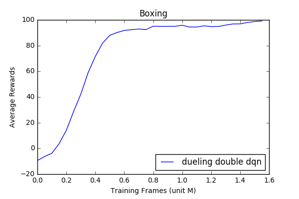
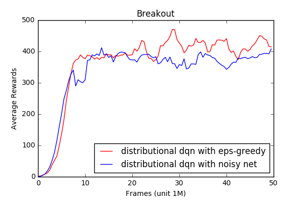

#Pytorch Implementation of Rainbow

This repo is a partial implementation of the [Rainbow](https://arxiv.org/pdf/1710.02298.pdf) 
agent published by researchers from DeepMind.
The implementation is efficient and of high quality. It trains at the speed of 
350 frames/s on my personal PC with a 3.5GHz CPU and GTX1080 GPU.

Rainbow is a deep Q learning based agent that combines a bunch of existing techiques
such as dueling dqn, distributional dqn, etc. This repo currenly implemented the 
following dqn variants:
* [DQN](https://www.nature.com/articles/nature14236)
* [Double DQN](https://arxiv.org/abs/1509.06461)
* [Dueling DQN](https://arxiv.org/abs/1511.06581)
* [Distributional DQN](https://arxiv.org/pdf/1707.06887.pdf)
* [Noisy Net](https://arxiv.org/abs/1706.10295)

and it will need the following extensions to become a full "Rainbow":
* Multi-step learning
* Priority Replay

##Hyperparameters

The hyperparameters in this repo follows the ones described in 
[Rainbow](https://arxiv.org/pdf/1710.02298.pdf)
paper as close as possible. However, there may still be some differences due to
misunderstanding.

##Performance

DQN agent often takes days to train. For sanity check, we can
train a agent to play a simple game "boxing". Follwing is the learning curve
of a dueling double dqn trained on boxing.

The agent almost solves boxing after around 12M frames, which is a good sign
that the implementation is working.

To test the distributional DQN and Noisy Net, the agent is trained on "breakout" since
distributional DQN performs significantly better than others on this game, 
reaching >400 scores rapidly while other DQN methods struggle to do so.

From the figure we see that the agent can reach >400 scores very rapidly and steadily.
Note that the publicly reported numbers on papers are produced by training the agent for
200M frames while here it trains only for 50M frames due to computation cost.

Figures here are smoothed.

##Future Works

We plan to implement multi-step learing and priority replay. Also, the current
implementation uses a simple wrapper on the [Arcade Learning Enviroment](https://github.com/mgbellemare/Arcade-Learning-Environment).
We may want to shift to OpenAI gym for better visualization and video recording.
On top of Rainbow, it will also be interesting to include other new techniques,
such as [Distributional RL with Quantile Regression](https://arxiv.org/pdf/1710.10044.pdf)

Contributions and bug-catchings are welcome!
